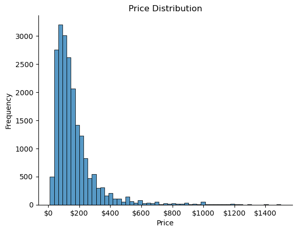
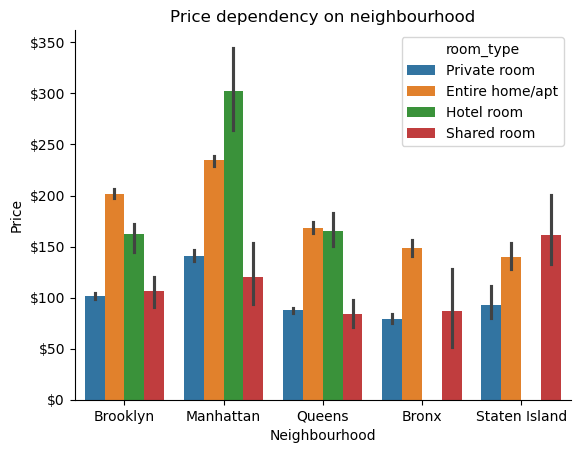
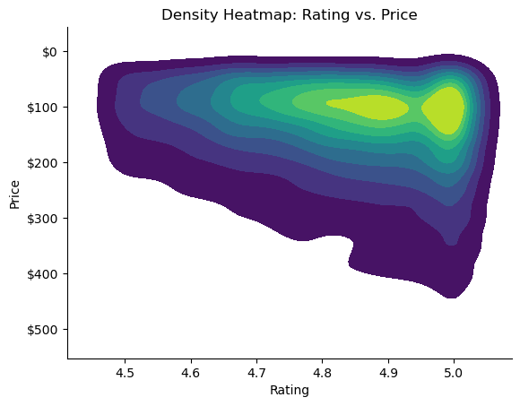
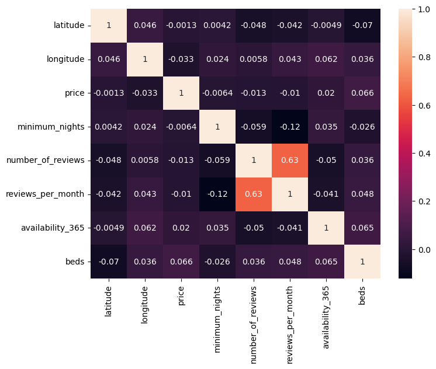

# Airbnb Listings EDA Project for New York 2024  

## Project Overview
This project performs **Exploratory Data Analysis (EDA)** on New York Airbnb data to uncover trends and patterns in rental listings. We use libraries like **Pandas, Numpy, Matplotlib, Seaborn**for cleaning, visualization, and analysis. 

## Objectives

1. Demonstrate proficiency in data cleaning, transformation, and exploratory data analysis (EDA) using Python.

2. Analyze Airbnb listing data to uncover actionable insights about pricing, availability, and guest satisfaction across New York neighborhoods.

3. Visualize key trends and relationships using advanced plotting techniques.

4. Identify value-for-money opportunities and patterns that can inform both guests and hosts.

5. Showcase the ability to communicate findings clearly and effectively for business decision-making.

---

## Dataset

- **Filename**: `new_york_listings_2024.csv`
- **Description**: Contains listing data such as price, location, reviews, rating, availability, and more.

---

## Libraries Used

```python
import pandas as pd
import numpy as np
import matplotlib.pyplot as plt
import seaborn as sns
import matplotlib.ticker as ticker
```

---

## Data Exploration & Cleaning

- Displayed dataset overview using:
  - `df.head()`
  - `df.tail()`
  - `df.shape`
  - `df.info()`
  - `df.describe()`

- **Cleaning Steps**:
  - Checked for and dropped all missing values: `df.dropna(inplace=True)`
  - Removed duplicate entries: `df.drop_duplicates(inplace=True)`
  - Type casting:
    - Converted `id` to `int64`
    - Converted `rating` to numeric

---

##  Univariate Analysis

- **Price Distribution**:
  ```python
  sns.histplot(data=df, x='price')
  sns.boxplot(data=df, x='price')
  ```

- **Outlier Removal**:
  - Filtered prices under $1500 for more meaningful analysis
  - Used histograms and boxplots on filtered data

- **Improved Price Distribution Plot**:
  - Customized with title, axis labels, and currency format

  ```python
    # Filtered Price Distribution 

    sns.histplot(data=df_price, x='price',bins=55)
    sns.despine()
    plt.title('Price Distribution')
    plt.xlabel('Price')
    plt.ylabel('Frequency')
    formatter = ticker.FormatStrFormatter('$%1.0f')
    plt.gca().xaxis.set_major_formatter(formatter)
    plt.show()   
  ```
- **Result**:

  

    *Histogram showing Price Distribution of different AirBnB listing in NewYork*

- **Insights**:

  - **Right-Skewed Distribution**: The majority of Airbnb listings are priced below $300, with frequency dropping as price increases.
  - **Most Common Price Range**: Most listings fall between $50 and $200, indicating this is the typical nightly rate.
  - **Few High-Priced Listings**: Listings above $500 are rare, and those above $1000 are very uncommon, suggesting luxury listings are limited.
  - **Potential Outliers**: The long right tail highlights the presence of outliers with exceptionally high prices.
  - **Market Accessibility**: The concentration of lower-priced listings suggests Airbnb in New York is accessible to a wide range of guests.


##  Feature Engineering

- Grouped mean price by `neighbourhood_group`
- Created new column:
  ```python
  df_price['price per bed'] = df_price['price'] / df['beds']
  ```

- Calculated average price per bed per neighborhood group:
    ```python
    # Mean price per bed
    df_price.groupby(by='neighbourhood_group')['price per bed'].mean()
    ```

  | Neighbourhood Group | Mean Price per Bed ($) |
  |---------------------|-----------------------|
  | Bronx               | 74.71                 |
  | Brooklyn            | 99.79                 |
  | Manhattan           | 138.71                |
  | Queens              | 76.34                 |
  | Staten Island       | 67.73                 |

---

## Bivariate Analysis

### 1. Price vs Neighbourhood & Room Type

  ```python
    sns.barplot(data=df_price,x='neighbourhood_group', y='price', hue='room_type')
    sns.despine()
    plt.title('Price dependency on neighbourhood by roomtype')
    plt.xlabel('Neighbourhood')
    plt.ylabel('Price')
    formatter = ticker.FormatStrFormatter('$%1.0f')
    plt.gca().yaxis.set_major_formatter(formatter)
    plt.show()
  ```
- **Result**:

  

    *Barplot showing the price vs neighbourhood and roomtype*

- **Insights**:

    - **Manhattan is the most expensive** for all room types, especially hotel rooms and entire homes/apartments.
    - **Entire home/apartment listings** are the priciest in every neighbourhood.
    - **Shared rooms** are the most affordable option across all boroughs.
    - **Brooklyn and Queens** offer mid-range prices, while **Bronx and Staten Island** are the most budget-friendly.
 
---

### 2. Reviews vs Price
  - Filtered listings with `number_of_reviews > 250`
  - Scatter plot with hue as `neighbourhood_group`

  ```python
    # Scatterplot visualizing the number of reviews and relative price 

    # Filtering
    df_reviews = df_price[df_price['number_of_reviews'] >250 ]
    sns.scatterplot(data=df_reviews, x='number_of_reviews',     y='price', hue='neighbourhood_group')
    sns.despine()
    plt.title("Locality and Review Dependency")
    plt.ylabel('Price')
    plt.xlabel('Number of reviews')
    formatter = ticker.FormatStrFormatter('$%1.0f')
    plt.gca().yaxis.set_major_formatter(formatter)
    plt.show()
  ```
- **Result**:

  

    *Scatterplot visualizing the number of reviews and relative prices by neighbourhood*

- **Insights**:

    - **Inverse Relationship:** Listings with a higher number of reviews tend to have lower prices, suggesting affordable options are more popular and frequently booked.
    - **Manhattan Outliers:** Some high-priced Manhattan listings still receive many reviews, indicating strong demand for premium locations.
    - **Brooklyn and Queens:** Most high-review, low-price listings are concentrated in Brooklyn and Queens, making them attractive for budget travelers.
    - **Few Expensive Listings with Many Reviews:** Very few listings above $500 have a large number of reviews, highlighting that luxury stays are less commonly booked.

---

### 3. Rating vs Price

    - 2D density heatmap (KDE) to visualize the relationship   between ratings and their prices, focusing on more affordable and higher-rated listings.
  - Filtered listings with `price < 500` and `rating >= 4.5`
  - KDE plot:

    ```python
    df_filtered = df_price[(df_price['price'] < 500) & (df_price['rating'] >= 4.5)]

    sns.kdeplot(
        data=df_filtered,
        x="rating", y="price",
        cmap="viridis", fill=True, thresh=0.05
    )
    sns.despine()
    plt.title("Density Heatmap: Rating vs. Price")
    plt.xlabel("Rating")
    plt.ylabel("Price")
    plt.gca().invert_yaxis() 
    formatter = ticker.FormatStrFormatter('$%1.0f')
    plt.gca().yaxis.set_major_formatter(formatter)
    plt.show()
    ```
- **Result**:

  

    *2D density heatmap to visualize the relationship  between ratings and their prices*

- **Insights**:

    - **High ratings cluster at lower prices:** Most top-rated listings (≥4.8) are found at lower price points.
    - **Affordable stays get better ratings:** Listings under $200 tend to receive the highest ratings.
    - **Few expensive, highly rated listings:** Premium, high-rated listings are rare.
    - **Value drives satisfaction:** Guest satisfaction is closely linked to affordability.


---

## Value for Money Listings

- **Filtering:** Selected listings with `rating > 4.5` and `price < $500` as "value-for-money" options.
- **Aggregation:** Grouped by `neighbourhood_group` and `room_type` to count qualifying listings.
- **Sorting:** Neighbourhoods ordered by total count of value-for-money listings.

```python
# Filter listings by rating > 4.5 and price < 500
df_filtered = df_price[(df_price['rating'] > 4.5) & (df_price['price'] < 500)]

# Group by neighbourhood and room type, then count
counts = df_filtered.groupby(['neighbourhood_group', 'room_type']).size().reset_index(name='count')

# Total counts per neighbourhood to sort by
neighbourhood_order = counts.groupby('neighbourhood_group')['count'].sum().sort_values(ascending=False).index

# Plotting
sns.barplot(
    data=counts,
    x='neighbourhood_group',
    y='count',
    hue='room_type',
    order=neighbourhood_order
)
sns.despine()
plt.title('Count of Value-for-Money Listings by Neighbourhood and Room Type')
plt.xlabel('Neighbourhood Group')
plt.ylabel('Number of Listings')
plt.show()
```

- **Result:**

  

  *Barplot showing the count of value-for-money listings by neighbourhood and room type*

- **Insights:**
  - **Brooklyn and Manhattan** have the highest number of value-for-money listings.
  - **Entire home/apartment** and **private rooms** are the most common value-for-money options across all neighbourhoods.
  - **Queens and Bronx** also offer a significant number of affordable, highly rated listings.
  - **Staten Island** has the fewest value-for-money listings overall.

---

## Geographical Distribution of Airbnb Listings

- **Visualization:** Scatter plot of listings by longitude and latitude, colored by `room_type`.
- **Purpose:** Shows the spatial spread and concentration of different room types across New York City.

```python
plt.figure(figsize=(10, 7))
sns.scatterplot(data=df, x='longitude', y='latitude', hue='room_type')
plt.title("Geographical Distribution of AirBnb Listing")
plt.xlabel('Longitude')
plt.ylabel('Latitude')
plt.show()
```

- **Result:**

  

  *Scatter plot showing the geographical distribution of Airbnb listings by room type*

- **Insights:**
  - **Listings are densely clustered** in Manhattan and Brooklyn, with sparser distribution in Staten Island.
  - **Entire home/apartment** and **private room** types dominate across all boroughs.
  - **Hotel and shared rooms** are less common and more scattered.
  - **Room types are well distributed** throughout the city, but premium locations (Manhattan) have higher listing density.

---

## Correlation Heatmap

- **Visualization:** Heatmap of correlations between key numerical variables.
- **Purpose:** Identifies relationships between price, reviews, availability, and other features.

```python
corr = df[['latitude', 'longitude', 'price', 'minimum_nights', 'number_of_reviews', 'reviews_per_month', 'availability_365', 'beds']].corr()

plt.figure(figsize=(8, 6))
sns.heatmap(data=corr, annot=True)
plt.show()
```

- **Result:**

  

  *Heatmap showing correlation between numerical features in the dataset*

- **Insights:**
  - **Number of reviews** and **reviews per month** are strongly correlated.
  - **Price** has weak correlation with most variables, indicating other factors may influence pricing.
  - **Latitude and longitude** show minimal correlation with other features.
  - **Beds** has a slight positive correlation with price, as expected.

---

## Recommendations

- **For Guests:**
  - Consider booking in Brooklyn or Queens for the best balance of price, quality, and availability.
  - Look for listings with high ratings and a large number of reviews for a more reliable experience.
  - Private rooms and entire apartments offer the most value-for-money options in most neighborhoods.

- **For Hosts:**
  - Competitive pricing and maintaining high ratings are key to attracting more bookings.
  - Enhancing guest experience in affordable listings can lead to higher ratings and more reviews.
  - Hosts in Manhattan and Brooklyn can leverage location advantages but should monitor pricing to remain competitive.

- **For Airbnb Platform:**
  - Highlight value-for-money listings to budget-conscious travelers.
  - Encourage hosts in underrepresented areas (like Staten Island) to improve listing quality and visibility.

---

## Conclusion

This project demonstrates strong data analysis and visualization skills using real-world Airbnb data. Through systematic EDA, we identified pricing trends, guest preferences, and value-for-money opportunities across New York City. The analysis highlights the importance of affordability and guest satisfaction, and provides actionable recommendations for both guests and hosts. These insights can help drive better business decisions and improve the overall Airbnb experience.

*This project showcases my ability to extract meaningful insights from complex datasets, communicate findings clearly, and provide data-driven recommendations—key skills for a data analyst role.*